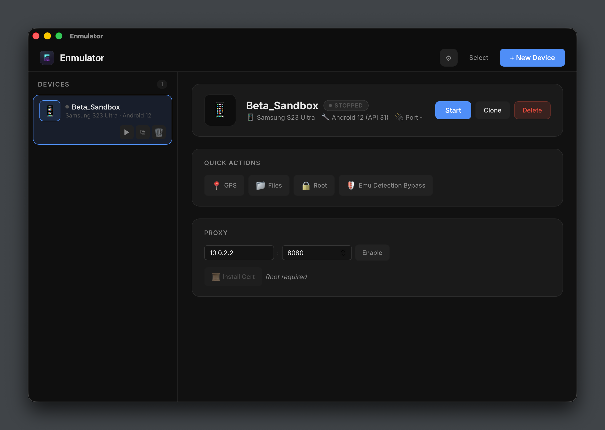
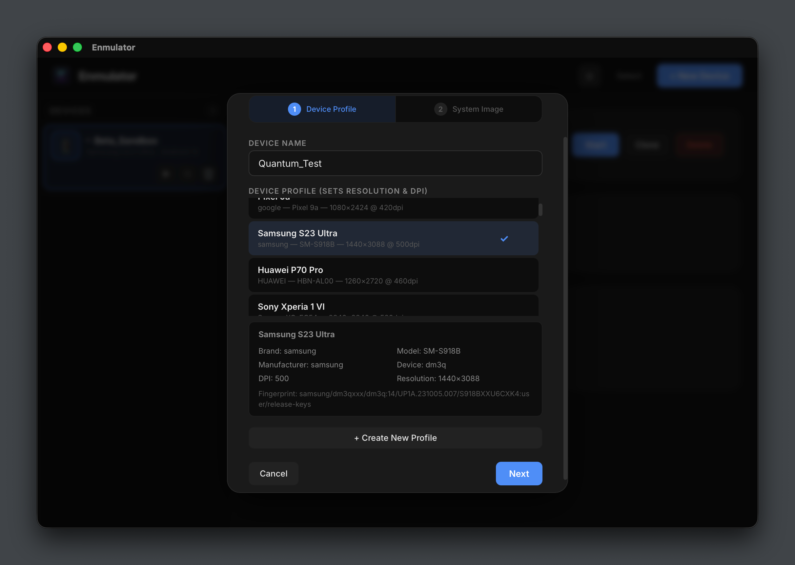
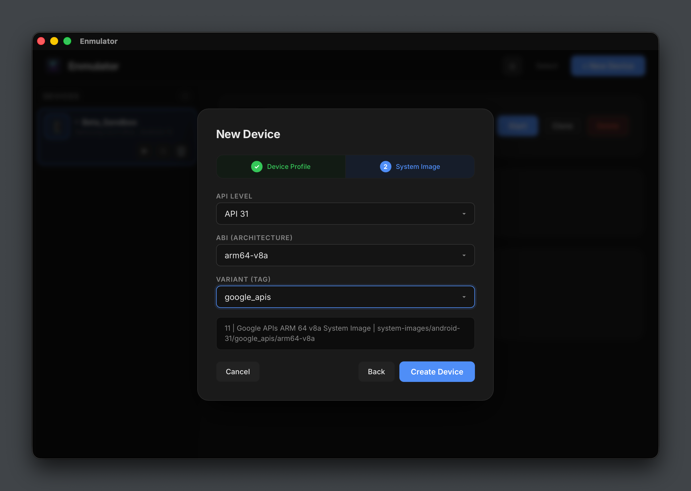
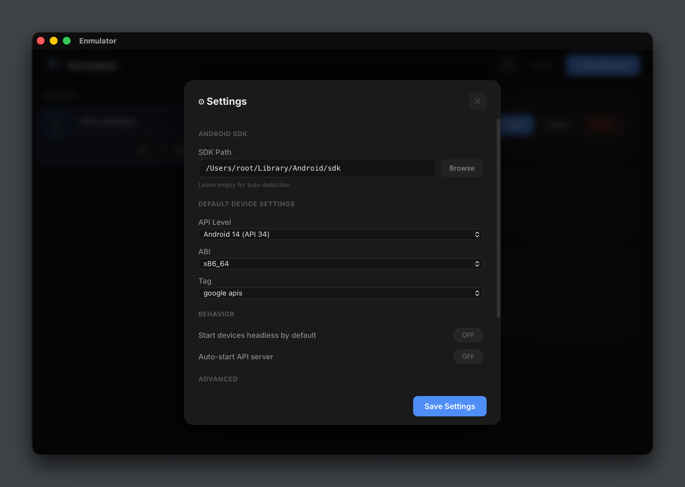

<p align="center">
  
  
  
  
</p>

<p align="center">
  
  
</p>

<h1 align="center">Enmulator</h1>
<p align="center"><strong>Cross-Platform Android Emulator Manager</strong></p>

<p align="center">
  <a href="https://github.com/engnzdl/enmulator/releases/download/v0.1.0/Enmulator_0.1.0_aarch64.dmg"></a>
  <a href="https://github.com/engnzdl/enmulator/releases/download/v0.1.0/Enmulator_0.1.0_x64_en-US.msi"></a>
  <a href="https://github.com/engnzdl/enmulator/releases/download/v0.1.0/Enmulator_0.1.0_amd64.AppImage"></a>
  <a href="https://github.com/engnzdl/enmulator/releases/download/v0.1.0/Enmulator_0.1.0_amd64.deb"></a>
</p>

<p align="center">
  
  
</p>
<p align="center">
  
  
</p>

<p align="center">Create, manage, and customize Android Virtual Devices with a premium desktop UI.<br>Built with Tauri 2 + React + Rust.</p>

---

##  Why Enmulator?

Managing Android emulators via command line is tedious. Android Studio is heavy and overkill if you just need AVDs. MuMuPlayer is Windows-only and closed-source.

**Enmulator** gives you a native, cross-platform desktop app that wraps the Android SDK tools in a beautiful, fast interface — no Android Studio required. 30 pre-loaded device profiles across 10 brands, batch operations, per-device proxy, GPS simulation, and more.

### vs The Alternatives

| | Android Studio AVD | Genymotion Desktop | BlueStacks | LDPlayer | **Enmulator** |
|---|---|---|---|---|---|
| **Platform** | macOS, Windows, Linux | macOS, Windows, Linux | Windows, macOS | Windows | **macOS, Windows, Linux** |
| **Size** | ~2 GB (IDE) | ~400 MB | ~500 MB | ~300 MB | **~15 MB binary** |
| **Price** | Free | **$479/yr** (Pro) | Free (ads) | Free (ads) | **Free · GPLv3** |
| **Open Source** |  |  |  |  | ** ** |
| **Focus** | Development | QA / CI | Gaming | Gaming | **Dev + Testing** |
| **Fingerprint Profiles** |  |  (manual) |  |  | **30 built-in, 10 brands** |
| **IMEI / SIM Spoofing** |  |  |  |  | **per-profile auto-apply** |
| **Batch Operations** |  |  (Pro) |  (multi-instance) |  (sync) | **multi-select start/stop/clone/APK** |
| **REST API** |  |  (Pro) |  |  | **built-in Actix-web server** |
| **Proxy per Device** |  |  |  |  | **host/port + cert installer** |
| **GPS Simulation** |  (extended controls) |  (widget) |  (basic) |  (basic) | **coordinate popup** |
| **Root Access** | `adb root` | `adb root` | built-in | built-in | **toggle (Google APIs)** |
| **Headless Mode** | `-no-window` |  (cloud) |  |  | **flag + auto-identity** |
| **Dark UI** |  (IDE theme) |  |  |  | **premium dark theme** |

##  Features

### Device Management
- **Create** — 2-step wizard: pick a fingerprint profile + system image. Auto-generated random name.
- **Start / Stop** — cold boot only (no snapshot save/load). Auto-detects manual emulator closes via polling.
- **Clone** — duplicates an AVD without snapshots. Auto-generated clone name.
- **Delete** — removes AVD directory and config entirely.
- **Batch** — multi-select: start, stop, delete, install APK across multiple devices at once.

### 30 Pre-Loaded Fingerprint Profiles

| Brand | Models |
|---|---|
| **Samsung** | S25 Ultra, S24 Ultra, S24, S23 Ultra, A55 |
| **Pixel** | 9 Pro, 9, 9a, 8 Pro |
| **Xiaomi** | 15 Ultra, 15, 14 |
| **OnePlus** | 13, 12 |
| **Huawei** | Mate 60 Pro, P70 Pro, P60 Pro |
| **Motorola** | Razr 50 Ultra, Edge 50 Ultra |
| **OPPO** | Find X8 Pro, Reno 12 Pro |
| **Nothing** | Phone 3a, Phone 2 |
| **Asus** | ROG Phone 9, Zenfone 11 Ultra |
| **Sony** | Xperia 1 VI, Xperia 5 VI |
| **Realme** | GT 7 Pro, GT 6, 14 Pro+ |

Each profile includes: build fingerprint, device codename, resolution, DPI, **IMEI, phone number, SIM operator, ICCID**.

### Identity Spoofing
- Per-profile identity auto-applied on device boot via `adb root` + `setprop`
- **IMEI 1 & 2**, **MEID** — generated with valid Luhn checksums
- **SIM operator** — MCC+MNC, display name, ISO country (brand-appropriate per region)
- **Phone number**, **ICCID** — unique per profile
- *Note: `ro.product.*` (model, brand) is immutable — determined by the system image*

### Quick Actions
- ** GPS** — set custom coordinates (Istanbul default, popup input)
- ** Files** — dual-pane file explorer (host + device)
- ** Root** — toggle `adb root` on Google APIs images
- ** Emu Detection Bypass** — set props to hide emulator from detection

### Per-Device Proxy
- HTTP proxy host + port per device
- Enable/disable toggle
- Certificate installer — push CA cert to system store (requires root)

### Settings Panel
Configurable via ⚙ gear icon:
- Android SDK path (auto-detect + manual browse)
- Default device: API level, ABI, system image tag
- Behavior: headless mode default, auto-start API server
- Advanced: devices directory, API server port

### Headless REST API

Built-in Actix-web server on configurable port (default: 8080). All responses are JSON.

| Method | Endpoint | Description |
|---|---|---|
| `GET` | `/api/devices` | List all devices |
| `POST` | `/api/devices` | Create a new device |
| `POST` | `/api/devices/{id}/start` | Start a device (headless) |
| `POST` | `/api/devices/{id}/stop` | Stop a device |
| `DELETE` | `/api/devices/{id}` | Delete a device |
| `POST` | `/api/devices/{id}/clone` | Clone a device |
| `POST` | `/api/devices/{id}/adb` | Run ADB shell command |
| `GET` | `/api/devices/{id}/logcat` | SSE logcat stream |
| `GET` | `/api/profiles` | List fingerprint profiles |

#### `GET /api/devices`

Returns all devices with their current state.

```bash
curl http://localhost:8080/api/devices
```

<details>
<summary>Response</summary>

```json
[
  {
    "id": "ultra_emu",
    "display_name": "Ultra_Emu",
    "avd_name": "enmulator_ultra_emu",
    "profile": "pixel_6_pro",
    "fingerprint_profile": "Samsung S25 Ultra",
    "api_level": 34,
    "status": "running",
    "port": 5554,
    "root_enabled": true,
    "adb_enabled": true,
    "created_at": "2026-05-12T01:00:00+00:00"
  }
]
```

</details>

#### `POST /api/devices`

Create a new AVD.

```bash
curl -X POST http://localhost:8080/api/devices \
  -H "Content-Type: application/json" \
  -d '{"name":"Test Device","api_level":34,"abi":"x86_64","tag":"google_apis"}'
```

| Field | Type | Required | Default | Description |
|---|---|---|---|---|
| `name` | string | yes | — | Display name (used as ID, lowercased) |
| `api_level` | int | yes | — | Android API level (34 = Android 14) |
| `abi` | string | no | `x86_64` | CPU architecture |
| `tag` | string | no | `google_apis` | System image variant |

<details>
<summary>Response → <code>201</code></summary>

```json
{
  "id": "test_device",
  "display_name": "Test Device",
  "avd_name": "enmulator_test_device",
  "profile": "pixel_6_pro",
  "fingerprint_profile": null,
  "api_level": 34,
  "status": "stopped",
  "port": 0,
  "root_enabled": false,
  "adb_enabled": true,
  "created_at": "2026-05-12T02:00:00+00:00"
}
```

</details>

#### `POST /api/devices/{id}/start`

Start a device in headless mode. Response includes the assigned port.

```bash
curl -X POST http://localhost:8080/api/devices/ultra_emu/start
```

<details>
<summary>Response → <code>200</code></summary>

```json
{ "port": 5554 }
```

</details>

#### `POST /api/devices/{id}/stop`

Stop a running device.

```bash
curl -X POST http://localhost:8080/api/devices/ultra_emu/stop
```

<details>
<summary>Response → <code>200</code></summary>

```json
{ "status": "stopped" }
```

</details>

#### `DELETE /api/devices/{id}`

Permanently delete a device and its AVD data.

```bash
curl -X DELETE http://localhost:8080/api/devices/ultra_emu
```

<details>
<summary>Response → <code>200</code></summary>

```json
{ "deleted": "ultra_emu" }
```

</details>

#### `POST /api/devices/{id}/clone`

Clone an existing device (AVD data copied, snapshots excluded).

```bash
curl -X POST http://localhost:8080/api/devices/ultra_emu/clone \
  -H "Content-Type: application/json" \
  -d '{"target_name":"Ultra Emu Clone"}'
```

<details>
<summary>Response → <code>200</code></summary>

```json
{
  "id": "ultra_emu_clone",
  "display_name": "Ultra Emu Clone",
  "avd_name": "enmulator_ultra_emu_clone",
  "status": "stopped",
  "port": 0,
  ...
}
```

</details>

#### `POST /api/devices/{id}/adb`

Execute an arbitrary ADB shell command on a running device.

```bash
curl -X POST http://localhost:8080/api/devices/ultra_emu/adb \
  -H "Content-Type: application/json" \
  -d '{"cmd":"getprop ro.build.version.sdk"}'
```

<details>
<summary>Response → <code>200</code></summary>

```json
{ "output": "34\n" }
```

</details>

#### `GET /api/devices/{id}/logcat`

Server-Sent Events (SSE) stream of real-time logcat output.

```bash
curl -N http://localhost:8080/api/devices/ultra_emu/logcat
```

<details>
<summary>Response → <code>200 text/event-stream</code></summary>

```
data: 05-12 02:00:01.234  1234  1234 I ActivityManager: Start proc ...
data: 05-12 02:00:01.456  1234  1235 D SurfaceFlinger: ...
data: 05-12 02:00:01.678  1234  1236 W PackageManager: ...
```

Streams indefinitely until client disconnects.

</details>

#### `GET /api/profiles`

List all available fingerprint profiles.

```bash
curl http://localhost:8080/api/profiles
```

<details>
<summary>Response (<abbreviated>)</summary>

```json
[
  {
    "name": "Samsung S25 Ultra",
    "brand": "samsung",
    "model": "SM-S938B",
    "device": "b5q",
    "fingerprint": "samsung/b5qxxx/b5q:15/...",
    "dpi": 500,
    "resolution_w": 1440,
    "resolution_h": 3120,
    "imei": "351371505786517",
    "imei2": "351371505786525",
    "phone_number": "+905723649220",
    "sim_operator": "28602",
    "sim_operator_name": "Vodafone TR",
    "sim_country": "tr",
    "sim_serial": "8905641752952096082"
  }
]
```

</details>

#### Error Format

All errors return `4xx` with a consistent JSON body:

```json
{ "success": false, "error": "Device not found" }
```

### Architecture
- **No Android Studio required** — only Android SDK command-line tools
- **Cold boot only** — no snapshot save/load, clean state every time
- **Auto port assignment** — 5554+ with 2-port increments, survives app restarts
- **KVM acceleration** — auto-enabled on Linux when `/dev/kvm` is available
- **Platform-native paths** — uses OS config/data dirs (`~/Library/Application Support`, `~/.config`, `%APPDATA%`)

##  Tech Stack

| Layer | Technology |
|---|---|
| **Desktop Shell** | [Tauri 2](https://v2.tauri.app/) (Rust) |
| **Frontend** | React 18 + TypeScript + Vite |
| **Backend** | Rust — 13 modules, ~25 Tauri commands |
| **REST API** | Actix-web 4 |
| **Styling** | CSS custom properties, premium dark theme |
| **Android** | SDK command-line tools (avdmanager, sdkmanager, adb, emulator) |

### Rust Modules

```
src-tauri/src/
├── main.rs          Tauri command handlers (25 commands)
├── emulator.rs      Emulator process lifecycle, port management
├── sdk.rs           SDK detection, sdkmanager/avdmanager wrapper
├── avd_manager.rs   AVD creation + config.ini overrides
├── adb_bridge.rs    ADB shell, setprop, install APK, push/pull
├── fingerprint.rs   Profile CRUD + apply_to_device identity
├── device.rs        Device struct + persistent store (JSON)
├── config.rs        App configuration (JSON)
├── paths.rs         Cross-platform config/data dirs
├── extras.rs        Screen recording, GPS, logcat
├── bypass.rs        Emulator detection bypass (setprop)
├── set_proxy.rs     Per-device HTTP proxy
├── api_server.rs    Actix-web REST API server
└── build.rs         Tauri build script
```

### React Components

```
src/components/
├── App.tsx              Main layout, device list, state management
├── DeviceCard.tsx       Sidebar device card with actions
├── CreateWizard.tsx     2-step creation modal with live progress
├── QuickActions.tsx     GPS, Files, Root, Bypass buttons
├── ProxyCard.tsx        Proxy host/port + cert installer
├── FileExplorer.tsx     Dual-pane file browser
├── SettingsPanel.tsx    Configuration modal
```

##  Quick Start

### Prerequisites

- [Android SDK Command-line Tools](https://developer.android.com/studio#command-line-tools-only) (or Android Studio)
- At least one system image (downloadable from within the app)
- [Rust](https://rustup.rs/) + [Node.js](https://nodejs.org/) (for building from source)

### Install

```bash
# Clone
git clone https://github.com/engnzdl/enmulator.git
cd enmulator

# Install dependencies
npm install

# Run (two terminals or combined)
npx vite --port 1420                    # Terminal 1: frontend
export PATH="$HOME/.cargo/bin:$PATH"    # Terminal 2: backend
npm run tauri dev
```

### First Launch

1. The app auto-detects your Android SDK. If not found, configure the path in Settings (⚙).
2. Create your first device: click **+ New Device** → pick a profile → select system image → create.
3. Click **Start** — the emulator boots (cold boot, ~30–60s). Profile identity (IMEI, operator) is auto-applied.
4. Use Quick Actions for GPS, file browsing, root, or emulator detection bypass.

##  Configuration

Settings are stored per-platform:
- **macOS:** `~/Library/Application Support/enmulator/config.json`
- **Linux:** `~/.config/enmulator/config.json`
- **Windows:** `%APPDATA%/enmulator/config.json`

Devices and profiles are stored in the same location hierarchy.

| Setting | Default | Description |
|---|---|---|
| `sdk_path` | auto-detect | Android SDK root directory |
| `devices_dir` | platform data dir | Where AVD data is stored |
| `api_server_port` | 8080 | Headless REST API port |
| `default_headless` | false | Start devices without window |
| `auto_start_api` | false | Auto-start API server on launch |
| `default_api_level` | 34 | Preferred Android API level |
| `default_abi` | x86_64 | Preferred CPU architecture |
| `default_tag` | google_apis | Preferred system image variant |

##  Building

### Prerequisites

1. Generate app icons and place them in `src-tauri/icons/`:
   - `icon.icns` (macOS, 1024x1024)
   - `icon.ico` (Windows, 256x256)
   - `32x32.png`, `128x128.png`, `128x128@2x.png` (Linux + generic)

   You can generate these from any 1024x1024 PNG using:
   ```bash
   # macOS: use iconutil or online converter
   # Linux: sudo apt install icnsutils
   png2icns src-tauri/icons/icon.icns icon-1024.png
   ```

2. Enable bundling in `src-tauri/tauri.conf.json`:
   ```json
   "bundle": { "active": true }
   ```

### Production Build

```bash
npm run tauri build
```

| Platform | Output |
|---|---|
| **macOS** | `src-tauri/target/release/bundle/dmg/Enmulator_*.dmg` |
| **Windows** | `src-tauri/target/release/bundle/msi/Enmulator_*.msi` |
| **Linux** | `src-tauri/target/release/bundle/deb/enmulator_*.deb` + `.AppImage` |

The binary is ~15 MB (plus Android SDK tools at runtime).

##  Tauri Commands (API Reference)

All available IPC commands for frontend invocation:

| Command | Args | Returns |
|---|---|---|
| `detect_sdk_cmd` | — | SDK path string |
| `list_available_images_cmd` | — | `Vec<SystemImage>` |
| `install_system_image_cmd` | `package` | streams `download-progress` events |
| `list_devices` | — | `Vec<Device>` |
| `create_device` | name, api_level, abi, tag, fingerprint_profile | `Device` |
| `delete_device` | id | — |
| `clone_device` | source_id, target_name | `Device` |
| `start_device` | id, headless | port: u16 |
| `stop_device` | id | — |
| `check_device_alive` | id | bool |
| `batch_start` / `batch_stop` / `batch_delete` | ids | `BatchResult` |
| `adb_shell` | id, cmd | stdout string |
| `install_apk` | id, apk_path | — |
| `set_device_proxy` / `enable_proxy` | id, host, port, enabled | — |
| `list_profiles` | — | `Vec<FingerprintProfile>` |
| `create_profile` / `delete_profile` | profile / name | — |
| `apply_profile` | device_id, profile_name | — |
| `set_device_identity` | device_id, imei?, imei2?, ... | — |
| `start_screen_record` / `stop_screen_record` | id | — |
| `clipboard_sync` | id, direction | clipboard content |
| `gps_set` | id, lat, lon | — |
| `logcat_start` | id | streams `logcat-line` events |
| `start_api_server` / `stop_api_server` | port | — |
| `get_config` / `update_config` | config fields | — |
| `set_sdk_path` | path | — |
| `bypass_detection` | id | — |
| `list_files` / `pull_file` / `push_file` | id, path | — |
| `toggle_root` | id | — |
| `install_cert` | id, cert_path | — |

##  Requirements

- **macOS:** 12.0+ (Monterey or later)
- **Windows:** 10+ with [WebView2](https://developer.microsoft.com/en-us/microsoft-edge/webview2/) (pre-installed on Windows 11)
- **Linux:** Ubuntu 20.04+ / Debian 11+ / Fedora 36+ with `libwebkit2gtk-4.1` and `libgtk-3`

### Recommended
- KVM enabled on Linux for hardware acceleration (`sudo usermod -aG kvm $USER`)
- At least 8 GB RAM for running multiple emulators
- SSD storage for AVD disk images

##  Limitations & Known Issues

- **`ro.product.*` properties** (model, brand, manufacturer) are immutable — determined by the system image, not the profile
- **Google APIs images** required for `adb root` (default selection)
- **ARM64 system images** only work on Apple Silicon Macs (use x86_64 on Intel/AMD)
- **Wayland** — non-headless mode requires XWayland on Wayland-only desktops
- Config and profile paths are CWD-relative in development builds (production uses platform directories)

##  Roadmap

- [ ] Release build packaging (.dmg, .msi, .AppImage)
- [ ] Custom fingerprint profile editor UI
- [ ] One-click Magisk installation for rooted images
- [ ] App install automation (batch APK from folder)
- [ ] Device group presets (save/load sets of devices)
- [ ] Network throttle / latency simulation
- [ ] Screenshot capture with annotation
- [ ] CI/CD for cross-platform release builds

##  Contributing

MIT licensed. Pull requests welcome.

```bash
git clone https://github.com/engnzdl/enmulator.git
cd enmulator
npm install
npm run tauri dev
```

Please ensure TypeScript (`npx tsc --noEmit`) and Rust (`cargo build`) both pass before submitting.

##  License

GNU General Public License v3.0

© 2025 [engnzdl](https://github.com/engnzdl)

This project is free software — you can use, modify, and distribute it under the terms of the GPL v3. Any derivative work must also be open-sourced under the same license (copyleft).

---

<p align="center">
  <sub>Built with  by <a href="https://github.com/engnzdl">engnzdl</a></sub>
</p>
